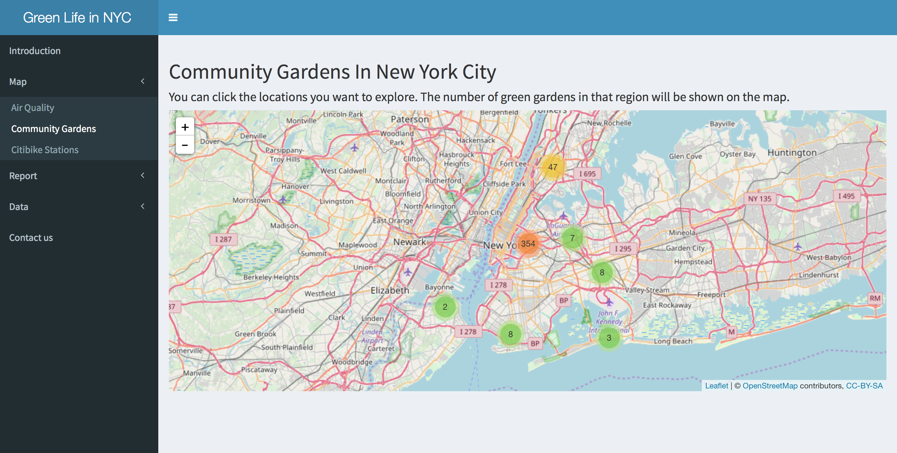

# Project 2: Open Data App - an RShiny app development project
### [Project Description](doc/project2_desc.md)


In this second project of GU4243/GR5243 Applied Data Science, we develop an *Exploratory Data Analysis and Visualization* shiny app on the topic of green life in NYC using U.S. government open data released on the [data.gov](https://data.gov/) website. See [Project 2 Description](doc/project2_desc.md) for more details.  

## Project Title: Green Life in NYC
Term: Fall 2017

+ Team 7
+ **Team members**:
	+ Lyrio, Joaquim jc4637@columbia.edu
	+ Gao, Xin xg2249@columbia.edu
	+ Guo, Xinyao xg2257@columbia.edu
	+ Ni, Jiayu jn2585@columbia.edu
	+ Thompson, Wyatt wct2112@columbia.edu
+ Link to our app: https://wct2112.shinyapps.io/greenlivingnewyork/



+ **Project summary**: 
	+ Do you want to explore the distribution of air pollution in NYC, find a place to live or a garden to hang out with cleaner air? 
	+ Do you want to fight the problem of air pollution by avoiding the harmful fossil-fuel combustion of motor vehicles? 
	+ Air pollutants are more present in dense urban areas, and if New York City is anything, it's a dense urban area. This is why we've made this tool for you. We want to help you live a life in New York City and enjoy the benefits of an urban life while avoiding the problems associated with breathing bad air.
	+ We believe that living green is important, and we want to empower you live green. Enjoy our tool by clicking on this [link](https://wct2112.shinyapps.io/greenlivingnewyork/) and use it to learn how to live an environmentally friendly life. 	

+ **Data source**: 
	+ The air quality dataset can be found at [data.gov](https://data.ny.gov/)
	+ The NYC Greenthumb Communicty Gardens can be found at [data.ny.gov](https://data.ny.gov/)
	+ The Citi Bike dataset can be found at [citibikenyc.com](https://www.citibikenyc.com/system-data)
+ **Contribution statement**: ([default](doc/a_note_on_contributions.md)) All team members are actively involved in all stages of this project. All team members approve our work presented in this GitHub repository including this contributions statement.
	+ Cavalheiro De Paoli Lyrio, Joaquim: create the structure of shiny app, create maps for gardens and citibike stations, lead the discussion, find and clean the datasets; 
	+ Gao, Xin: complete the shiny structure, contribute to the 6 quantile maps for air quality, contribute to radar plots for each neighbourhood's air quality, clean the datasets;
	+ Guo, Xinyao: complete the shiny structure, contribute to the statistical analysis for air quality, explore on creating heatmap, find the datasets;
	+ Ni, Jiayu: complete the shiny structure, contribute the statistical analysis for citibike stations;
	+ Thompson, Wyatt: complement the shiny structure, contribute the introduction and all text parts, explore on creating heatmap, find the datasets. 

Following [suggestions](http://nicercode.github.io/blog/2013-04-05-projects/) by [RICH FITZJOHN](http://nicercode.github.io/about/#Team) (@richfitz). This folder is orgarnized as follows.

```
nyc-green-life/
├── app/
	├── data/
	├── www/
```

Please see each subfolder for a README file.

